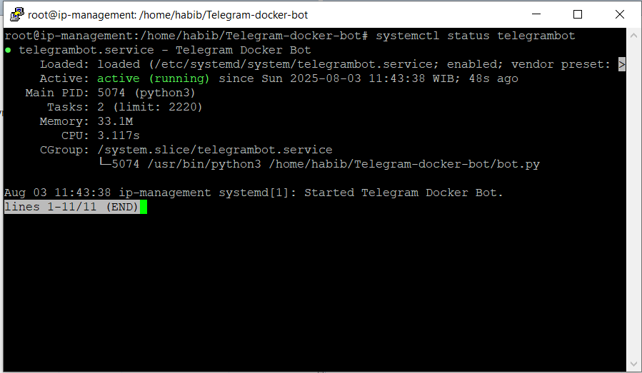
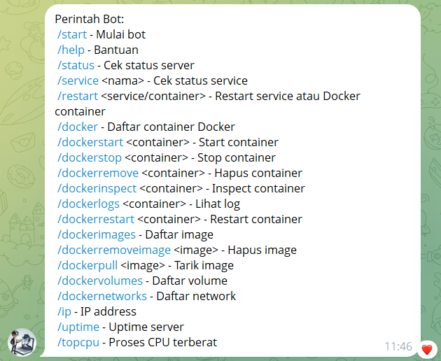

# 🛠️ Telegram Docker & Service Bot

[](https://www.python.org/downloads/)
[](LICENSE)
[](https://core.telegram.org/bots)

<p align="center">
  
</p>

<h3 align="center">Kontrol dan Monitor Server Linux Anda dari Telegram</h3>

<p align="center">
  
</p>

<p align="center">
  Bot Telegram yang kuat untuk mengelola service systemd dan container Docker langsung dari chat Anda.
</p>

---

## 📑 Daftar Isi

- [Fitur Utama](#-fitur-utama)
- [Instalasi di Server](#-instalasi-di-server)
- [Menjalankan Bot Manual](#️-menjalankan-bot-manual)
- [Menjalankan Otomatis dengan systemd](#-menjalankan-otomatis-dengan-systemd)
- [Izin Sudo (untuk restart service)](#-izin-sudo-untuk-restart-service)
- [Notifikasi SSH Login](#-notifikasi-ssh-login)
- [Perintah di Telegram](#-perintah-di-telegram)
- [Variabel Lingkungan](#-variabel-lingkungan)
- [Troubleshooting](#-troubleshooting)
- [Keamanan](#-keamanan)
- [FAQ](#-faq)
- [Roadmap](#-roadmap)
- [Kontribusi](#-kontribusi)
- [Lisensi](#-lisensi)
- [Dibuat oleh](#-dibuat-oleh)

---

## 📦 Fitur Utama

- 🖥️ **Monitoring Server**: Cek status server (uptime, CPU, RAM, disk)
- 🐳 **Manajemen Docker**: Kontrol container dan images (start, stop, restart, logs, inspect, remove, pull)
- ⚙️ **Service Control**: Restart service systemd
- 🚨 **SSH Notification**: Dapatkan notifikasi saat ada login SSH ke server
- 💬 **Perintah Praktis**: Semua kontrol langsung dari Telegram

<p align="center">
  
</p>

---

## 🚀 Instalasi di Server

### 1. Clone Repositori

```bash
git clone https://github.com/frambudi75/Bot-cek-service-docker-dan-server.git
cd Bot-cek-service-docker-dan-server
```

### 2. Buat Virtual Environment (opsional tapi direkomendasikan)

```bash
python3 -m venv env
source env/bin/activate  # Linux/Mac
# atau
env\Scripts\activate     # Windows
```

### 3. Install Dependencies

```bash
pip install -r requirements.txt
```

### 4. Konfigurasi File `.env`

Buat file `.env` dari template:

```bash
cp .env.example .env
```

Edit `.env` dan sesuaikan dengan konfigurasi Anda:

```env
BOT_TOKEN=isi_token_bot_anda_dari_@BotFather
ALLOWED_USER_ID=123456789  # ID Telegram Anda (bisa dapat dari @userinfobot)
```

**Cara mendapatkan BOT_TOKEN:**
1. Buka Telegram dan cari @BotFather
2. Ketik `/newbot` dan ikuti instruksi
3. Salin token yang diberikan

**Cara mendapatkan ALLOWED_USER_ID:**
1. Buka Telegram dan cari @userinfobot
2. Mulai chat dengan bot tersebut
3. Salin ID yang ditampilkan

---

## ▶️ Menjalankan Bot Manual

```bash
python3 bot.py
```

Bot akan aktif dan siap menerima perintah dari Telegram.

---

## 🔁 Menjalankan Otomatis dengan systemd

Untuk menjalankan bot secara otomatis saat server dinyalakan:

### 1. Buat File Service

```bash
sudo nano /etc/systemd/system/telegrambot.service
```

Isi dengan konfigurasi berikut (sesuaikan path dan user dengan sistem Anda):

```ini
[Unit]
Description=Telegram Docker Bot
After=network.target

[Service]
User=youruser
WorkingDirectory=/home/youruser/Telegram-docker-bot
ExecStart=/usr/bin/python3 bot.py
Restart=always
Environment=BOT_TOKEN=xxx
Environment=ALLOWED_USER_ID=xxx

[Install]
WantedBy=multi-user.target
```

### 2. Aktifkan dan Jalankan Service

```bash
# Reload konfigurasi systemd
sudo systemctl daemon-reload

# Aktifkan service untuk otomatis start saat boot
sudo systemctl enable telegrambot

# Jalankan service
sudo systemctl start telegrambot
```

### Perintah Berguna untuk Manajemen Service:

```bash
# Cek status service
sudo systemctl status telegrambot

# Lihat log real-time
sudo journalctl -u telegrambot -f

# Restart service
sudo systemctl restart telegrambot

# Stop service
sudo systemctl stop telegrambot
```

---

## 🔐 Izin Sudo (untuk restart service)

Agar bot bisa merestart service systemd, Anda perlu memberikan izin sudo tanpa password:

### 1. Edit File Sudoers

```bash
sudo visudo
```

### 2. Tambahkan Baris Berikut

Ganti `your_username` dengan username Anda:

```
your_username ALL=(ALL) NOPASSWD: /bin/systemctl restart *
```

### 3. Izin untuk Docker

Agar bisa mengelola Docker container:

```bash
sudo usermod -aG docker your_username
```

Lalu logout dan login kembali atau restart sesi Anda.

---

## 🚨 Notifikasi SSH Login

Bot juga bisa mengirim notifikasi ke Telegram setiap kali ada login SSH ke server:

### 1. Konfigurasi Script

Edit file `ssh_login_notify.sh`:

```bash
nano ssh_login_notify.sh
```

Ganti nilai berikut dengan yang sesuai:

```bash
TOKEN="ISI_BOT_TOKEN_ANDA"
CHAT_ID="ISI_CHAT_ID_ANDA"
```

### 2. Aktifkan Script

Tambahkan baris berikut ke file `/etc/profile` atau `~/.bashrc`:

```bash
# Tambahkan ke akhir file
if [ -n "$SSH_CONNECTION" ]; then
  /path/to/Bot-cek-service-docker-dan-server/ssh_login_notify.sh
fi
```

---

## ✅ Perintah di Telegram

Ketik `/help` di bot untuk melihat semua perintah yang tersedia.

### Perintah Dasar:
- `/start` - Mulai bot dan menampilkan pesan selamat datang
- `/help` - Menampilkan daftar semua perintah
- `/status` - Cek status server (uptime, CPU, RAM, disk, IP)

### Perintah Service:
- `/service <nama_service>` - Cek status service systemd
- `/restart <service>` - Restart service systemd

### Perintah Docker:
- `/docker` - Daftar semua container Docker
- `/dockerstart <container>` - Start container Docker
- `/dockerstop <container>` - Stop container Docker
- `/dockerrestart <container>` - Restart container Docker
- `/dockerlogs <container>` - Lihat log container Docker (20 baris terakhir)
- `/dockerremove <container>` - Hapus container Docker
- `/dockerinspect <container>` - Inspect detail container Docker
- `/dockerimages` - Daftar semua Docker images
- `/dockerpull <image>` - Tarik (download) Docker image
- `/dockerremoveimage <image>` - Hapus Docker image
- `/dockervolumes` - Daftar Docker volumes
- `/dockernetworks` - Daftar Docker networks

### Perintah System:
- `/ip` - Tampilkan IP address server (publik dan lokal)
- `/uptime` - Tampilkan uptime server
- `/topcpu` - Tampilkan proses yang paling banyak menggunakan CPU

---

## 🌍 Variabel Lingkungan

Berikut adalah variabel lingkungan yang digunakan dalam aplikasi ini:

| Variabel | Deskripsi | Contoh Nilai |
|----------|-----------|--------------|
| `BOT_TOKEN` | Token API untuk bot Telegram Anda | `1234567890:ABCDEF1234567890abcdef1234567890` |
| `ALLOWED_USER_ID` | ID Telegram pengguna yang diizinkan mengakses bot | `123456789` |

---

## 🔧 Troubleshooting

### Masalah Umum:

1. **Bot tidak merespon:**
   - Pastikan BOT_TOKEN di `.env` benar
   - Cek apakah bot berjalan dengan `systemctl status telegrambot`
   - Verifikasi ALLOWED_USER_ID sudah benar

2. **Tidak bisa restart service:**
   - Pastikan izin sudo sudah dikonfigurasi
   - Cek apakah user ada di grup docker dengan `groups`

3. **Docker commands tidak berfungsi:**
   - Verifikasi user sudah di grup docker
   - Pastikan Docker service berjalan dengan `systemctl status docker`

4. **Notifikasi SSH tidak muncul:**
   - Cek apakah script `ssh_login_notify.sh` sudah dikonfigurasi dengan benar
   - Pastikan token dan chat ID sudah benar

---

## 🛡️ Keamanan

- Jangan bagikan BOT_TOKEN dengan siapa pun
- Batasi pengguna yang bisa mengakses bot dengan ALLOWED_USER_ID
- Gunakan izin sudo yang spesifik (hindari `ALL=(ALL) NOPASSWD: ALL`)
- Pertimbangkan untuk menggunakan firewall untuk membatasi akses SSH

---

## ❓ FAQ

### Apakah bot ini aman digunakan?

Ya, bot ini aman digunakan selama Anda mengikuti panduan keamanan yang telah disediakan. Pastikan untuk:
- Menjaga kerahasiaan BOT_TOKEN
- Hanya mengizinkan pengguna tertentu melalui ALLOWED_USER_ID
- Menggunakan izin sudo yang spesifik

### Bisakah saya menggunakan bot ini di server produksi?

Ya, bot ini bisa digunakan di server produksi. Namun, pastikan Anda:
- Memahami setiap perintah yang dijalankan oleh bot
- Menggunakan izin sudo yang terbatas
- Memantau aktivitas bot secara berkala

### Bagaimana cara memperbarui bot ke versi terbaru?

```bash
git pull origin main
pip install -r requirements.txt
sudo systemctl restart telegrambot
```

### Apakah bot ini bisa mengelola banyak server?

Bot ini dirancang untuk mengelola satu server tempat bot dijalankan. Untuk mengelola banyak server, Anda perlu menjalankan instance bot terpisah di setiap server.

---

## 🗺️ Roadmap

### Versi Mendatang

- [ ] Dukungan untuk mengelola multiple server dari satu bot
- [ ] Notifikasi otomatis untuk penggunaan resource yang tinggi
- [ ] Dukungan untuk lebih banyak perintah Docker
- [ ] Integrasi dengan platform monitoring seperti Grafana
- [ ] Dukungan multi-bahasa

---

## 🤝 Kontribusi

Kontribusi sangat dihargai! Untuk berkontribusi:

1. Fork repositori ini
2. Buat branch fitur (`git checkout -b feature/AmazingFeature`)
3. Commit perubahan (`git commit -m 'Add some AmazingFeature'`)
4. Push ke branch (`git push origin feature/AmazingFeature`)
5. Buka Pull Request

---

## 📄 Lisensi

Distributed under the MIT License. See `LICENSE` for more information.

---

## 👤 Dibuat oleh

Habib Frambudi

[](https://github.com/frambudi75)
[](https://t.me/frambudi75)

---

## 🙏 Terima Kasih
